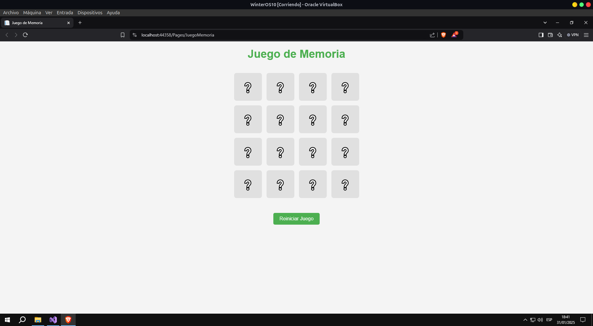
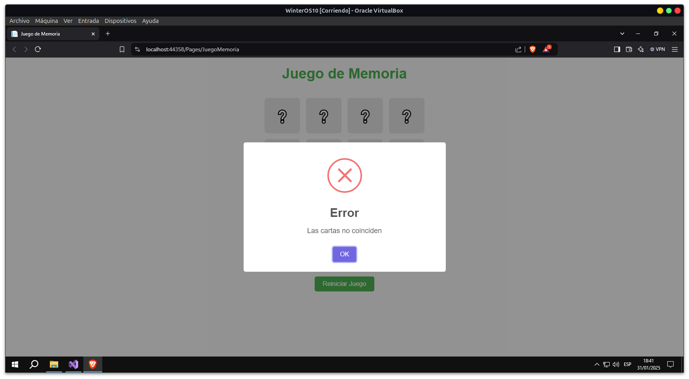
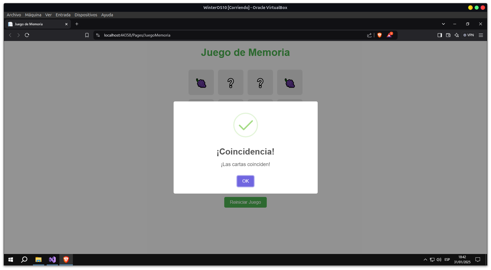
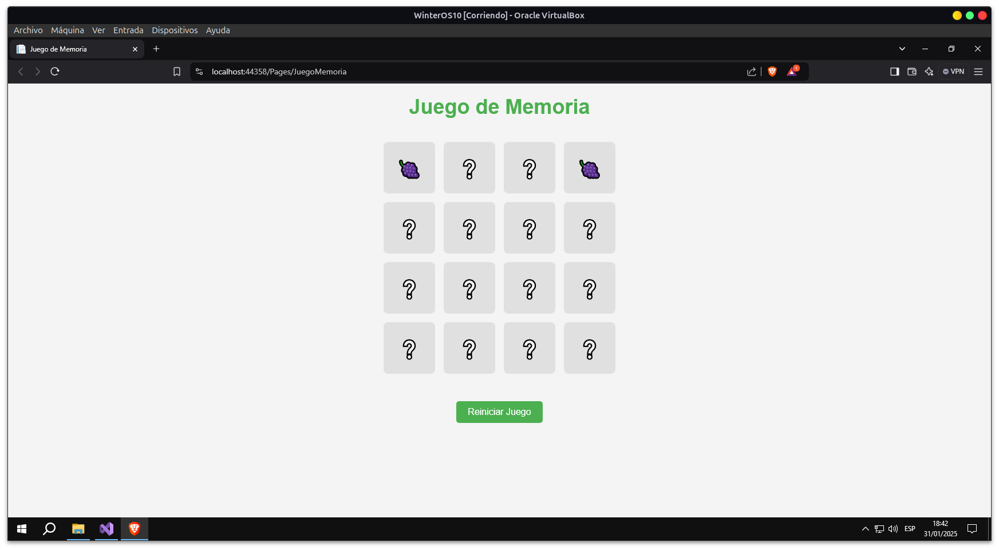

# Juego de Memoria

Este es un juego de memoria desarrollado en C# utilizando ASP.NET. El objetivo del juego es voltear dos cartas a la vez, tratando de encontrar pares de cartas que coincidan.

## Descripción

El juego consta de un conjunto de cartas con símbolos, dispuestas de manera aleatoria en un tablero. El jugador puede hacer clic sobre las cartas para voltearlas y ver los símbolos. Si las cartas volteadas coinciden, permanecen visibles; si no coinciden, se voltean nuevamente.

### Características:

- El tablero está compuesto por un conjunto de cartas con símbolos.
- El jugador puede voltear hasta dos cartas a la vez.
- Si las cartas volteadas coinciden, se quedan visibles.
- Si no coinciden, las cartas se voltean nuevamente después de un breve intervalo.
- El juego se reinicia con un solo clic en el botón "Reiniciar Juego".
- Se muestra un mensaje de alerta cada vez que el jugador acierta un par o no.

## Tecnologías Usadas

- **ASP.NET WebForms**: Para la construcción de la aplicación web.
- **C#**: Para la lógica del juego en el backend.
- **JavaScript**: Para manejar los eventos de clic en el frontend y las interacciones con el tablero.
- **SweetAlert2**: Para mostrar alertas visuales cuando se aciertan o fallan pares de cartas.

## Estructura del Proyecto

El proyecto consta de los siguientes archivos principales:

1. **JuegoMemoria.aspx**: El archivo de la interfaz de usuario que contiene el tablero de cartas y el botón de reiniciar juego.
2. **JuegoMemoria.aspx.cs**: El archivo de código detrás que contiene la lógica para gestionar el juego, como la comparación de cartas y la reinicialización del juego.
3. **Carta.cs**: El modelo que representa una carta con un símbolo.

## Instrucciones para Ejecutar

1. **Clonar el repositorio**:

   ```bash
   git clone https://github.com/Hades0413/JuegoDeMemoria.git
   ```

2. **Abrir el proyecto en Visual Studio**:

3. **Ejecutar el proyecto**:

Haz clic en "Iniciar" o presiona Ctrl + F5 para ejecutar la aplicación web en tu navegador.

"https://localhost:44358/Pages/JuegoMemoria"
El puerto puede cambiar

4. **Interacción con el Juego**:

   ```bash
   Haz clic en las cartas para voltearlas y busca los pares coincidentes.
   ```

   ```bash
   Si las cartas no coinciden, se voltearán automáticamente después de un breve intervalo.
   ```

   ```bash
   Haz clic en el botón Reiniciar Juego para comenzar una nueva partida.
   ```

## Funcionamiento de la Lógica

**Lógica de Volteo de Cartas**:

```bash
Se permite voltear un máximo de dos cartas a la vez. Si el jugador intenta voltear más de dos cartas, no se realiza ninguna acción.
```

```bash
Si las dos cartas volteadas coinciden, permanecen visibles.
```

```bash
Si no coinciden, después de un breve intervalo, las cartas se voltean nuevamente.
```

**Interacciones con el Backend**:

```bash
Cuando se hace clic en una carta, se actualiza su estado en el backend para mantener un registro de las cartas volteadas.
```

```bash
Se verifica si las cartas volteadas coinciden o no, y se presenta una alerta correspondiente.
```

```bash
Si el jugador gana (es decir, todas las cartas se han emparejado correctamente), se muestra una alerta de victoria.
```

**Reiniciar el Juego**:

El botón de Reiniciar Juego permite reiniciar la partida, barajando las cartas y comenzando de nuevo.

**Capturas_de_pantalla**:

1. 
2. 
3. 
4. 


## Personas Desarrolladoras del Proyecto
Eduardo Miguel Jaime Gomero

## Licencia
Este proyecto está bajo la Licencia MIT. Para más detalles, consulta el archivo LICENSE.

